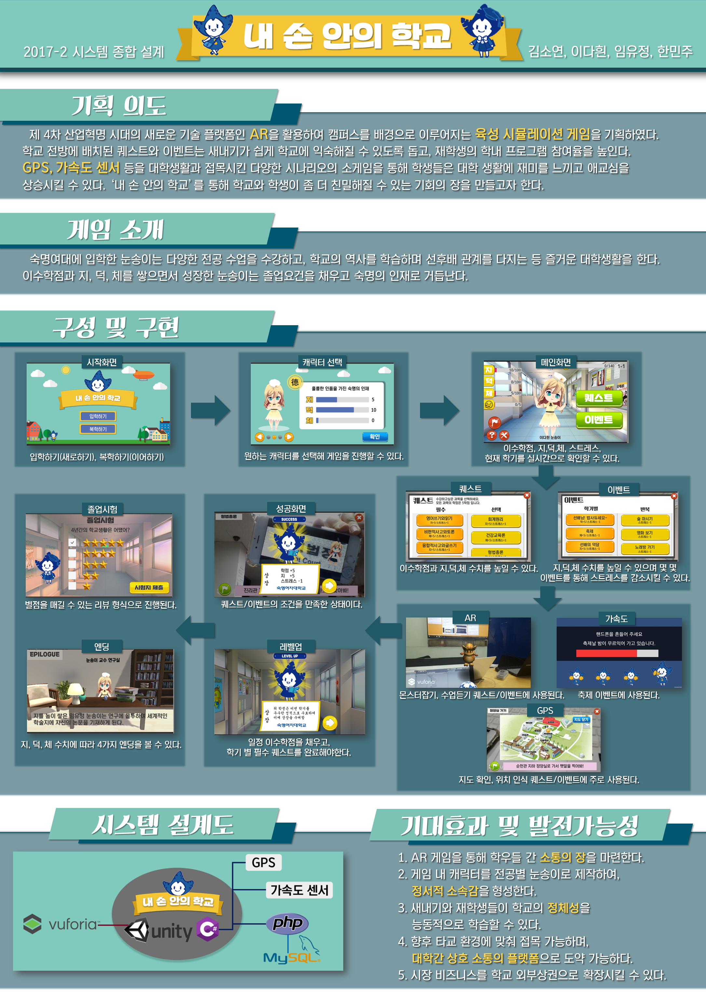
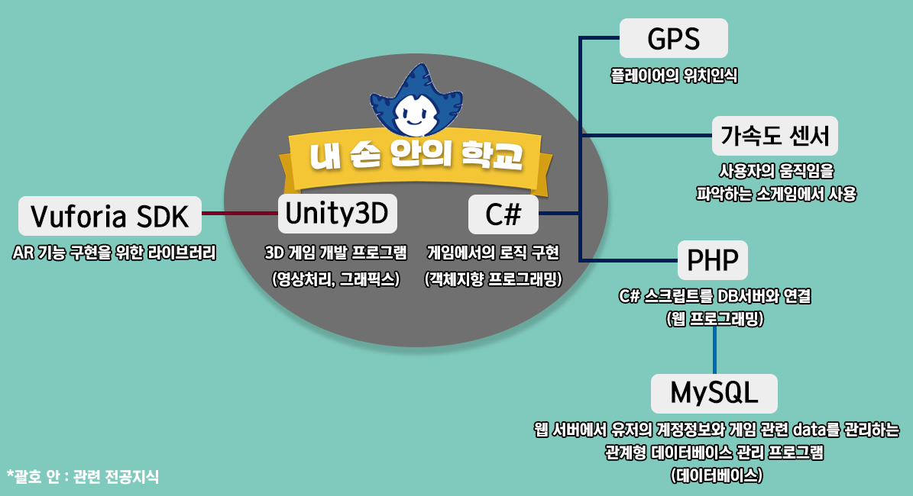

# 내 손 안의 학교

> 내 손 안의 학교는 AR 육성 시뮬레이션 게임으로, 주인공 눈송이를 입학부터 졸업까지 수업 듣기(전공, 교양 등), 스펙 쌓기 등의 퀘스트를 통해 육성하는 게임입니다. 

[안드로이드 다운로드](https://drive.google.com/file/d/14NRzxCzf0J_nB12_KM2Y3GC7UpI6zfTg/view?usp=sharing)

## Index

- 소개
- 기술 스택
- 기능별 구현

  
   

  
   

&nbsp;

## 소개 

### 개발자

김소연, 이다흰, 임유정, 한민주

### 수상

숙명여대 캡스톤 디자인 경진대회 (숙명여대 프라임 사업단 주최) - 총장상(3등 수상)

&nbsp;

## 기술 스택

&nbsp;

---

## 기능 별 구현

(게임 프로젝트 특성상 각종 asset 이 포함되어 용량이 큰 관계로 프로젝트 전체를 올리지 못함. 핵심 코드만 git 에 남김)